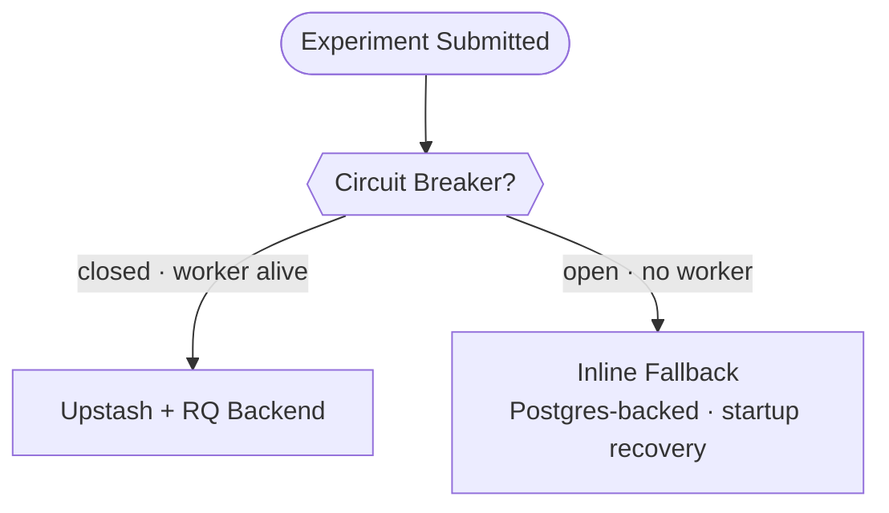
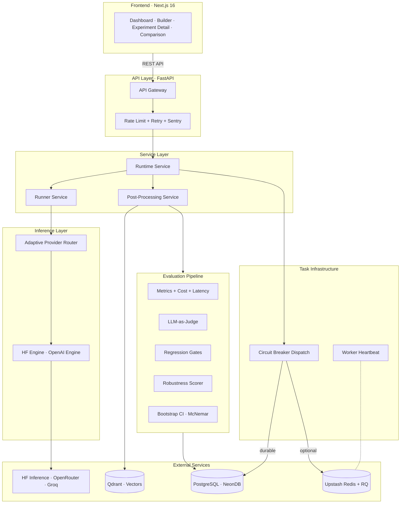

<div align="center">

# LlmForge

**A full-stack experimentation platform for systematically evaluating LLM reasoning strategies**

[](https://github.com/FazlulKarimC/LLM_Forge/actions/workflows/ci.yml)

[](https://python.org)
[](https://fastapi.tiangolo.com)
[](https://nextjs.org)
[](https://react.dev)
[](https://tailwindcss.com)
[](https://neon.tech)
[](https://upstash.com)
[](#testing)

*Compare Naive Prompting, Chain-of-Thought, RAG, and ReAct Agents side-by-side with statistical significance testing, execution provenance, and a research-grade dashboard.*

</div>

---

## Overview

LlmForge is a config-driven platform for designing, executing, and comparing LLM experiments. Each experiment combines a **reasoning method**, **dataset**, **model**, **inference provider**, and **hyperparameters** — all version-controlled in a database with full execution provenance. After execution, the platform computes quality, performance, and cost metrics, surfacing them through an interactive dashboard with per-sample inspection, latency distributions, and side-by-side statistical comparison with methodology-aware caveats.

Built to answer a core question: *How do different LLM reasoning strategies trade off accuracy, latency, and token cost on real QA benchmarks?*

### Why LlmForge?

- **Not just metrics — provenance.** Every run records the exact provider served, routing reason, cost, prompt version hash, and runtime-adjusted settings. You can audit *why* a result happened, not just *what* it was.
- **Free-tier survivable.** Circuit breakers, inline fallbacks, and durable Postgres job recovery mean the platform stays operational even when Upstash archives your Redis or HF cold-starts your Space.
- **Research-honest.** Statistical comparisons surface overlap ratios, discordant pair counts, and power warnings instead of presenting p-values as cleaner than they are.

---

## Key Features

### Four Reasoning Strategies

- **Naive Prompting** — Direct question-answer with zero-shot or few-shot templates
- **Chain-of-Thought (CoT)** — Step-by-step reasoning elicitation before the final answer
- **RAG** — Dense, hybrid, or reranked retrieval-augmented generation over indexed knowledge bases
- **ReAct Agent** — Dynamic multi-step tool calling (Wikipedia search, Calculator, Retrieval) with observation-action traces

### Adaptive Multi-Provider Routing

Route experiments through **HuggingFace Inference API**, **OpenRouter**, **Groq**, or any **OpenAI-compatible endpoint**. An epsilon-greedy **Adaptive Provider Router** handles provider selection based on active policies (`cheapest_first`, `fastest_first`, or `adaptive` via composite score on latency, cost, and error rate) and tracks routing telemetry. Per-run `served_provider`, `routing_reason`, and `cost_usd` are persisted for full auditability.

### Resilient Task Dispatch

A protocol-based dispatch abstraction (`Auto`, `Inline`, `UpstashRQ` backends) with a **30-minute circuit breaker** that handles Upstash Redis free-tier archival gracefully. A `worker_heartbeats` table detects missing RQ workers before dispatching jobs into the void. Neon/Postgres is the mandatory durable backend; Upstash+RQ is an optional acceleration layer.



### Trajectory Regression Gates

Pin completed experiments as **Baselines** with strict lineage tracking. New candidate runs are automatically evaluated against pinned baselines using a deterministic 8-rule **Grader Engine** (max turns, required tools, expected dataset-driven tool paths, token/latency budgets, F1 score). Strict comparison routing mode prevents provider/fallback contamination from skewing regression verdicts. Clear pass/fail/skip verdicts with inline configuration diffing.

### Prompt Versioning

Immutable **PromptVersion** records are stored in the database and applied during execution — not just metadata. The prompt version hash is included in every run manifest for reproducibility. Unsupported strategy + version combinations fail loudly instead of silently ignoring the saved prompt.

### Execution Provenance

Every experiment execution produces a persisted **Effective Execution Manifest** — the runtime-adjusted settings that were actually used (after provider fallbacks, config normalization, and routing decisions). Combined with per-run `served_provider`, `routing_reason`, and `cost_usd`, this creates a complete audit trail from configuration to result.

### Comprehensive Metrics and Evaluation

| Category | Metrics |
|----------|---------|
| **Accuracy** | Exact match, substring match, F1 score, accuracy excluding infrastructure failures |
| **Completion** | Infrastructure failure rate, completion quality tiering (Full / Partial / Degraded), parse method tracking |
| **Latency** | p50, p95, p99, per-sample histogram (10-bucket distribution) |
| **Cost** | Token usage breakdown, estimated USD, cost-per-correct-answer, cost-per-sample, accuracy-per-dollar |
| **Quality** | LLM-as-Judge scoring (coherence, helpfulness, factuality) — budget-capped |
| **Retrieval** | RAG Recall@k, context-support rate (computed against gold dataset annotations) |
| **Safety** | Deterministic robustness score against prompt injection, jailbreak, and edge-case adversarial datasets |
| **Statistical** | Bootstrap 95% CI, McNemar's chi-squared test, pass@k, multi-trial variance |

### Side-by-Side Comparison Workspace

Compare any two experiments with methodology-aware statistical analysis:

- McNemar's chi-squared test for paired statistical significance
- Bootstrap confidence intervals on accuracy deltas
- Agreement / disagreement distribution bars
- Per-example output diffs with correctness annotations
- **Methodology caveats** — overlap ratio, discordant pair count, power warnings, and routing/provider confound notes surfaced inline

### Filmstrip Evaluator

A colour-coded correctness grid at the per-sample level. Click any cell to inspect the full prompt, model output, expected answer, routing reason, per-run cost, retrieved context chunks (RAG), and complete agent traces (ReAct).

### Safety and Robustness Testing

Three adversarial datasets (`prompt_injection`, `jailbreak`, `edge_cases`) with a deterministic rule-based robustness scorer. `REFUSE` and `HANDLE_GRACEFULLY` are treated as behavioral evaluation directives — not literal expected strings. Inconclusive results are no longer counted as safe by default.

### Inference Optimization

- **Batch Execution** — Parallelized API calls via thread pools with per-phase profiling
- **Prompt Caching** — LRU cache for deterministic runs to avoid redundant API calls
- **Rate Limiting and Retry** — Exponential backoff with jitter, global concurrency gating
- **Generation Config Fidelity** — `seed`, `top_k`, and zero temperature are preserved through to provider calls

### Export and Reporting

Download results as **JSON** or a formatted **Markdown report** directly from the UI. Reports include configuration, effective execution manifest, metrics summary, routing/cost metadata, and per-run correctness tables.

---

## Architecture



---

## Tech Stack

| Layer | Technology |
|-------|------------|
| **Backend** | Python 3.12, FastAPI, SQLAlchemy (async), Alembic, Pydantic v2, statsmodels, NumPy |
| **Frontend** | Next.js 16, TypeScript, React 19, Tailwind CSS v4, Framer Motion, TanStack Query, Sonner, Lucide |
| **Database** | PostgreSQL via NeonDB (serverless) |
| **Vector Store** | Qdrant Cloud (RAG document retrieval) |
| **Task Queue** | Durable Postgres-backed background jobs (startup recovery), Upstash Redis + RQ (optional, circuit-breaker protected) |
| **Inference** | HuggingFace Inference API, OpenRouter, Groq, OpenAI-compatible endpoints |
| **Observability** | Sentry (full-stack distributed error tracking) |
| **Embeddings** | sentence-transformers (CPU-friendly) |
| **CI/CD** | GitHub Actions (lint, typecheck, pytest, Vitest — all hard gates) |

---

## Frontend Pages

| Route | Description |
|-------|-------------|
| `/` | Landing page — animated WebGL hero, live comparison preview, feature overview |
| `/dashboard` | Operational dashboard — KPI cards, system readiness checks (task dispatch, Upstash, RQ worker status), experiment queue with inline actions |
| `/experiments` | Experiment catalog — filterable list with baseline pinning, regression status pills, and run/delete controls |
| `/experiments/new` | Experiment builder — model/dataset/provider selectors, preset templates, complexity indicator, honest dataset labeling |
| `/experiments/[id]` | Experiment detail — lifecycle metadata, execution manifest, progressively-loaded metrics, regression/routing panels, filmstrip evaluator, latency histogram, run profiler, export |
| `/experiments/compare` | Comparison workspace — metric deltas, statistical significance with methodology caveats, agreement bars, per-example diffs |

---

## Design System

The UI follows a custom **dark-first editorial tech** design language:

- **OKLCH colour palette** with semantic tokens for consistent theming
- **Glass morphism** surfaces with `color-mix` tints and layered depth
- **Framer Motion** micro-animations on metrics, page transitions, and data renders
- **Reusable component library** — `PageHeader`, `Panel`, `MetricCard`, `StatusPill`, `AnimatedNumber`, `MetricBar`, `EmptyState`, `SkeletonBlock`
- **Collapsible sidebar** with persistent state and theme toggle (dark / light)
- **Accessible** — focus rings, keyboard navigation, colour-independent status icons, screen-reader utilities

Full reference: [`DESIGN_SYSTEM.md`](./DESIGN_SYSTEM.md)

---

## Supported Datasets

| Dataset | Category | Description |
|---------|----------|-------------|
| `sample` | Smoke Test | Built-in mixed QA for quick validation |
| `trivia_qa` | Factual QA | Single-hop open-domain factual recall |
| `commonsense_qa` | Reasoning | Everyday logic and commonsense reasoning |
| `multi_hop` | Reasoning | Composite multi-fact bridging questions |
| `math_reasoning` | Math | GSM8K-style word problems |
| `react_bench` | Agent | Tool-use questions with gold expected tool path annotations |
| `knowledge_base` | RAG | Grounded QA with gold chunk/evidence annotations for RAG validation |
| `prompt_injection` | Safety | Tests instruction override resistance (diagnostic) |
| `jailbreak` | Safety | Tests DAN-style jailbreak resistance (diagnostic) |
| `edge_cases` | Safety | Tests unusual or malformed inputs (diagnostic) |

> **Note:** Safety datasets are diagnostic-scale adversarial probes, not broadly representative benchmarks.

---

## Getting Started

### Prerequisites

- Python 3.12+
- Node.js 18+
- [NeonDB](https://neon.tech) PostgreSQL connection string (free tier)
- [Upstash](https://upstash.com) Redis connection string (free tier — optional, platform works without it)
- Inference API token (HuggingFace, OpenRouter, Groq, or custom endpoint)

### Backend

```bash
git clone https://github.com/FazlulKarimC/LLM_Forge.git
cd LLM_Forge/backend

python -m venv venv
.\venv\Scripts\activate        # Windows
# source venv/bin/activate     # Linux / macOS

pip install -r requirements.txt
```

Create `.env` in `/backend`:

```env
DATABASE_URL=postgresql+asyncpg://<user>:<pass>@<host>/neondb
HF_TOKEN=hf_...
INFERENCE_ENGINE=hf_api
HF_PROVIDER=novita
REDIS_URL=redis://...         # Upstash Redis URL (optional)
ENVIRONMENT=production        # "development" to skip Redis
SENTRY_DSN=https://...        # Sentry DSN (optional)
```

Run migrations and start the server:

```bash
alembic upgrade head
uvicorn app.main:app --reload --port 8000
```

### Frontend

```bash
cd ../frontend
npm install
npm run dev
```

Open **<http://localhost:3000>**

---

## Running an Experiment

### Via the UI

1. Navigate to **Experiments > New Experiment**
2. Select a reasoning strategy (Naive / CoT / RAG / ReAct), dataset, model, and inference provider
3. Optionally choose a **preset configuration**, attach a **prompt version**, or provide a custom LLM endpoint
4. Enable **Batching** or **Caching** under the optimization section
5. Click **Create and Run** — the detail page auto-polls until execution completes
6. Inspect results via the **filmstrip evaluator**, **metrics cards**, **latency histogram**, and **execution manifest**
7. Navigate to the **Comparison workspace** to run a statistical A/B test against another experiment
8. **Export** results as JSON or Markdown

### Via the API

```bash
# Create
curl -X POST http://localhost:8000/api/v1/experiments \
  -H "Content-Type: application/json" \
  -d '{
    "name": "cot_vs_naive_multihop",
    "config": {
      "model_name": "meta-llama/Llama-3.2-1B-Instruct",
      "reasoning_method": "cot",
      "dataset_name": "multi_hop",
      "provider": "auto",
      "num_samples": 20,
      "hyperparameters": { "temperature": 0.1, "max_tokens": 512 }
    }
  }'

# Run
curl -X POST "http://localhost:8000/api/v1/experiments/{id}/run"

# Metrics
curl http://localhost:8000/api/v1/results/{id}/metrics

# Statistical comparison
curl "http://localhost:8000/api/v1/results/compare/statistical?experiment_a={id_a}&experiment_b={id_b}"

# Export
curl http://localhost:8000/api/v1/results/{id}/export
```

---

## Testing

```bash
cd backend
pip install -r requirements-dev.txt
pytest
```

**469+ tests** covering: API routes, experiment lifecycle, metrics computation, prompting strategies, RAG retrieval, agent execution, optimization profiling, statistical comparison, prompt versioning, task dispatch with circuit breaker fallbacks, routing policy behavior, execution provenance, robustness scoring, comparison methodology warnings, and end-to-end integration tests.

Frontend tests run via Vitest + React Testing Library:

```bash
cd frontend
npm test
```

---

<p align="center">
  <b>Config-driven experiments · Multi-provider inference · Execution provenance · Statistical rigor</b>
</p>
