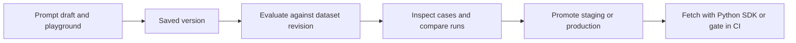
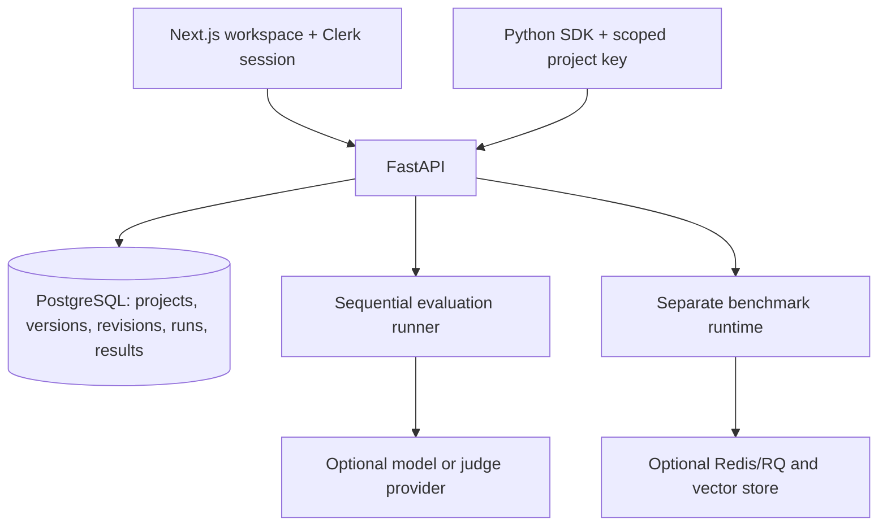

# LLMForge

**Version, evaluate, and release prompts.** LLMForge is a project-scoped workspace for testing prompt changes against saved cases before an application or CI job uses a release.

[](https://github.com/FazlulKarimC/LLM_Forge/actions/workflows/ci.yml)

A prompt that works on one example can break another after a small edit. LLMForge keeps each prompt version and dataset revision fixed, records per-case outputs and checks, and shows regressions between runs. It is a personal engineering project intended for a reliable, explainable demo; mock mode needs no model account.



## Try the provider-free demo

1. Sign in, select a project, and choose **Create demo examples** on Overview. This creates or reuses the `Echo demo` prompt and a two-case `Greetings` dataset in that project; conflicting content is never overwritten.
2. In Evaluations, keep the preselected prompt version and dataset revision. Choose **Demo** and **Exact match**, then start the run. Both cases pass because mock output echoes the compiled `{{query}}` template.
3. Save a second prompt version containing `Reply: {{query}}`. Evaluate it against the **same** dataset revision. Compare the two runs and inspect the regressed cases: the new output breaks the exact-match contract.
4. Promote the passing version to production in the prompt's Releases tab. Create a read-only project key in Settings and fetch that release with the Python SDK.

This demo checks a deterministic output contract; it does **not** measure real model quality. For a useful live example, try a support-ticket classifier with JSON labels, a fixed dataset, JSON assertions, and an optional judge rubric. See the [evaluation guide](docs/PHASE_3_EVALUATIONS.md) for limits and live-provider setup.

## What the workspace supports

- **Prompts:** draft editor and playground, immutable versions, staging/production labels, rollback, and an Integrate tab for SDK access.
- **Datasets:** versioned cases, case-table and advanced JSON editing, CSV/JSON import preview, and exact revision links into evaluation setup.
- **Evaluations:** exact match, contains, regex, JSON checks including per-case JSON references, optional LLM judge, cancellation, per-case results, and comparison on the same dataset revision. The results view distinguishes candidate from reference and warns when assertions differ.
- **Workspaces and keys:** Clerk sessions for the web app; organization/project isolation; hashed project keys with read-only access by default and optional evaluation scope for CI. Owners manage project keys in Settings.
- **Python SDK and CI:** fetch a released or pinned prompt, compile variables locally, run a version-pinned evaluation, submit application-computed results, and fail a quality gate. The SDK installs from this repository; it is not published to PyPI. External submissions are self-reported.
- **Reasoning benchmarks:** a separate Benchmarks area supports Naive, CoT, RAG, and ReAct experiments, provider routing, execution provenance, and statistical comparison. See [benchmark details](docs/BENCHMARKS.md).

## Run locally

Prerequisites: Python 3.12+, Node.js 20.9+, PostgreSQL, and a Clerk application. The mock evaluation path needs no provider, Redis, or vector-store account. Set up Clerk using the [workspace guide](docs/PHASE_1_SETUP.md).

```powershell
git clone https://github.com/FazlulKarimC/LLM_Forge.git
cd LLM_Forge/backend
python -m venv venv
.\venv\Scripts\Activate.ps1
python -m pip install -r requirements.txt -c constraints.txt
Copy-Item .env.example .env
```

Set `DATABASE_URL`, `CLERK_ISSUER_URL`, and `CLERK_AUTHORIZED_PARTIES` in `backend/.env`; keep `INFERENCE_ENGINE=mock`. The issuer is your Clerk application's URL, and the local authorized party is `http://localhost:3000`. Replace example secrets rather than committing them.

```powershell
alembic upgrade head
uvicorn app.main:app --reload --port 8000
```

In a second terminal:

```powershell
cd LLM_Forge/frontend
Copy-Item .env.example .env.local
npm ci
npm run dev
```

Set `NEXT_PUBLIC_CLERK_PUBLISHABLE_KEY`, `CLERK_SECRET_KEY`, and `NEXT_PUBLIC_API_URL=http://localhost:8000/api/v1` in `frontend/.env.local`, then open [localhost:3000](http://localhost:3000). `/health` checks the API process; `/ready` checks required database and dispatch health and reports optional services separately. Run Alembic migrations against each target database before starting a new backend image. The [testing guide](docs/TESTING.md) covers local checks and PostgreSQL smoke testing.

## Use a tested prompt in Python

Install the SDK from the repository root and create a project key in Settings. Promote `Echo demo` v1 to production for this example. A normal key can fetch prompts; select **Allow evaluations for CI** on a new key only if the process needs to run or submit evaluations.

```powershell
python -m pip install -e ./sdk/python
$env:LLMFORGE_URL = 'http://localhost:8000/api/v1'
$env:LLMFORGE_API_KEY = '<project key from Settings>'
```

```python
from llmforge import LLMForge

with LLMForge() as forge:
    prompt = forge.get_prompt("Echo demo", label="production")
    print(prompt.version, prompt.compile(query="Hello"))
```

For a reproducible gate, use an evaluation-enabled key and pin both versions:

```powershell
python -m llmforge evaluate --prompt 'Echo demo' --version 1 --dataset Greetings --dataset-version 1 --min-pass-rate 1 --output artifacts/evaluation.json
```

The CLI exits 0 on pass, 1 for a quality regression or case errors, and 2 for an operational or configuration failure. Hosted CI needs a reachable persistent backend and the key in a secret store. See the [SDK/CI guide](docs/PHASE_4_SDK.md), [package reference](sdk/python/README.md), and [example GitHub workflow](docs/examples/evaluation-gate.yml).

## Architecture and limits



The selected project scopes dashboard requests. Immutable prompt versions and dataset revisions make comparisons reproducible; release labels move between saved versions without changing them. Provider keys for evaluation requests stay in memory and are excluded from saved run configuration. The evaluation runner uses FastAPI background tasks and a persistent backend process: cancelling prevents later calls, while an in-flight provider call may finish; a restart can fail a run rather than resume it. This is an explicit tradeoff for the project's scale. Benchmark dispatch has its own optional Redis/RQ path.

Repository CI runs backend/SDK tests, builds and installs the SDK wheel, migrates a disposable PostgreSQL database for an HTTP smoke test, and checks frontend lint, types, tests, and production build. A passing CI run gates the repository's Hugging Face backend sync. No hardcoded test count or screenshot is used as proof of current behavior.

## Guides

- [Workspace and authentication](docs/PHASE_1_SETUP.md)
- [Prompt editor, versions, and releases](docs/PHASE_2_PROMPTS.md)
- [Datasets and evaluations](docs/PHASE_3_EVALUATIONS.md)
- [Python SDK and CI](docs/PHASE_4_SDK.md)
- [Reasoning benchmarks](docs/BENCHMARKS.md)
- [Testing](docs/TESTING.md)
- [Design system](DESIGN_SYSTEM.md)

The public `/docs` page provides a short product walkthrough; the repository guides hold the full setup and API details.
